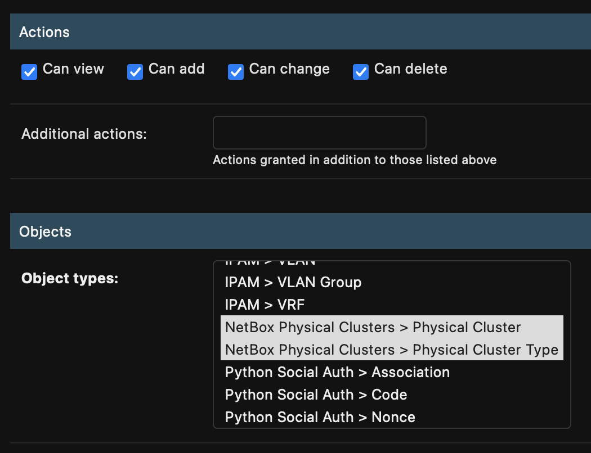

 Installing the Plugin in Netbox

Here you will find detailed instructions on how to __install__ and __configure__ the Plugin.

## Prerequisites

- The plugin is compatible with Netbox 3.5.0 and higher.
- Databases supported: PostgreSQL

### Access Requirements

No external systems access is required to use this plugin.

## Install Guide

!!! note
    Plugins can be installed manually or using Python's `pip`. See the [netbox documentation](https://docs.netbox.dev/en/stable/plugins/) for more details. The pip package name for this plugin is [`netbox_device_groups`](https://pypi.org/project/netbox_device_groups/).

The plugin is available as a Python package via PyPI and can be installed with `pip`:

```shell
pip install netbox-device-groups
```

To ensure the device group plugin is automatically re-installed during future upgrades, create a file named `local_requirements.txt` (if not already existing) in the Netbox root directory (alongside `requirements.txt`) and list the `netbox_device_groups` package:

```shell
echo netbox-device-groups >> local_requirements.txt
```

Once installed, the plugin needs to be enabled in your Netbox configuration. The following block of code below shows the additional configuration required to be added to your `$NETBOX_ROOT/netbox/configuration.py` file:

- Append `"netbox_device_groups"` to the `PLUGINS` list.
- Append the `"netbox_device_groups"` dictionary to the `PLUGINS_CONFIG` dictionary and override any defaults.

```python
PLUGINS = [
    "netbox_device_groups",
]
PLUGINS_CONFIG = {
    "netbox_device_groups": {
        "USERNAME": "foo",
        "PASSWORD": "bar",
    }
}
```

## Post Install Steps

Once the Netbox configuration is updated, run the post install steps from the _Netbox Home_ to run migrations and clear any cache:

```shell
# Apply any database migrations
python3 netbox/manage.py migrate
# Trace any missing cable paths (not typically needed)
python3 netbox/manage.py trace_paths --no-input
# Collect static files
python3 netbox/manage.py collectstatic --no-input
# Delete any stale content types
python3 netbox/manage.py remove_stale_contenttypes --no-input
# Rebuild the search cache (lazily)
python3 netbox/manage.py reindex --lazy
# Delete any expired user sessions
python3 netbox/manage.py clearsessions
# Clear the cache
python3 netbox/manage.py clearcache
```

Then restart the Netbox services:

```shell
sudo systemctl restart netbox netbox-rq
```

## Permissions

This plugins employs the Netbox object-based permissions framework, which replaces Django's built-in permissions model. These object-based permissions enable an administrator to grant users or groups the ability to perform an action on the objects provided by this plugin.

### Actions

There are four core actions that can be permitted for each type of object within NetBox, roughly analogous to the CRUD convention (create, read, update, and delete):

- __View__ - Retrieve an object from the database
- __Add__ - Create a new object
- __Change__ - Modify an existing object
- __Delete__ - Delete an existing object

On the Permissions admin page, choose the actions you require, and assign them to the __Netbox Device Groups__ objects, then assign a group or user to the permission.

{{: style="height:40%;width:40%;"}