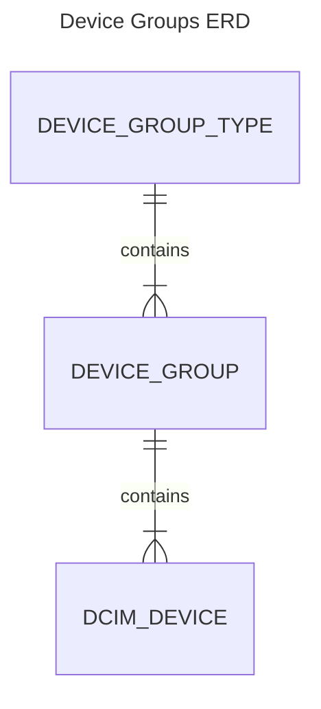

# Introduction

## Purpose

A device group represents a logical grouping of physical resources within which shared services will run. Physical devices may be associated with device groups as server hosts, network devices, and storage arrays. This plugin will allow users to track in which device group(s) a particular device may reside.

### Intended Audience and Reading suggestions

!!! warning "Developer Note - Remove Me!"
    Information on design conventions.

### Project Scope

!!! warning "Developer Note - Remove Me!"
    Information on design conventions.

## Overall Description

### Feature Perspective

!!! warning "Developer Note - Remove Me!"
    Feature Perspective

### Characteristics

!!! warning "Developer Note - Remove Me!"
   Characteristics

### Operating Environment and Dependencies

!!! warning "Developer Note - Remove Me!"
    Operating Environment and Dependencies

### Entity Relationship Diagram

### Design and Implementation Constraints

!!! warning "Developer Note - Remove Me!"
    Design and Implementation Constraints
